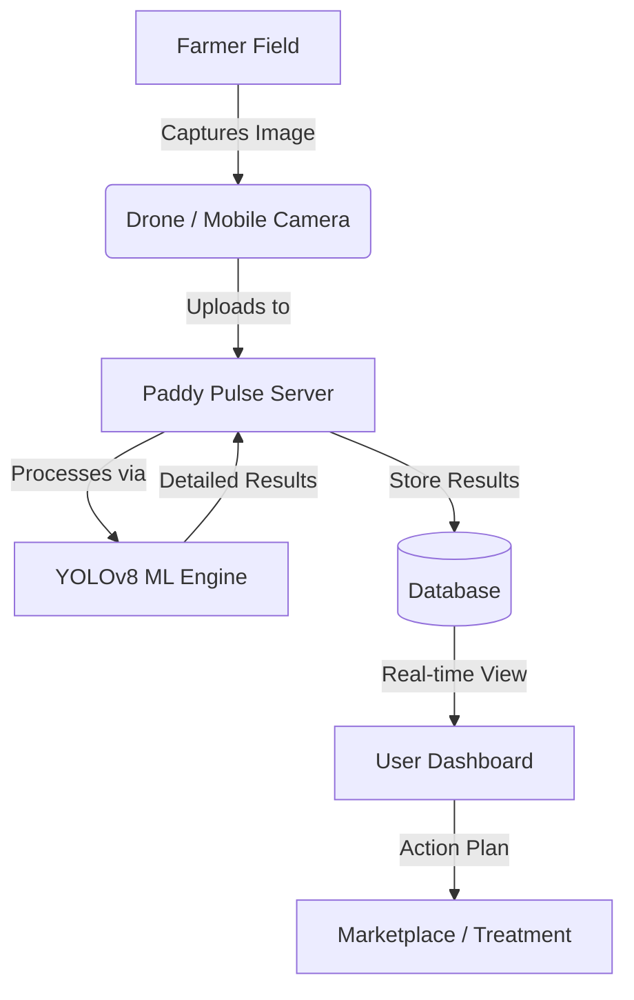
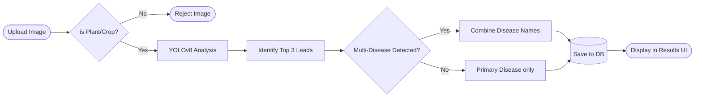

# Paddy Pulse: Advanced AI-Driven Rice Cultivation Platform

## 1. Project Overview
**Paddy Pulse** is a comprehensive, state-of-the-art agricultural monitoring platform designed exclusively for rice (paddy) cultivation. By integrating **Drone Technology**, **AI Object Detection**, and **IoT Sensors**, it provides farmers and administrators with actionable insights to detect diseases early, monitor field health in real-time, and optimize crop yields.

### Core Mission
To empower farmers with high-tech solutions that simplify disease management and provide data-driven field analysis.

---

## 2. Technology Stack

### **Frontend (Client)**
- **React.js (Vite)**: Core framework for a fast, reactive user interface.
- **GSAP (GreenSock)**: Used for premium text animations (`SplitText`) and smooth transitions.
- **Tailwind CSS**: Modern utility-first styling for a premium, responsive design.
- **Framer Motion**: For component-level animations.
- **i18next**: Multilingual support (English and Telugu).
- **Lucide React**: High-quality iconography.

### **Backend (Server)**
- **Node.js & Express**: Scalable API architecture.
- **YOLOv8 (Ultralytics)**: High-performance AI model for image classification (Retrained for 30 epochs with 97.4% accuracy).
- **Python (ML Engine)**: Handles heavy computation for AI predictions and image processing.
- **PostgreSQL / SQLite**: Dual-database strategy with Supabase for cloud and SQLite for local fallback.

---

## 3. System Architecture & Workflows

### 3.1 Overall System Workflow
The system operates on an integrated loop of data collection, processing, and reporting.



### 3.2 AI Analysis Flowchart (Manual Check)
This describes the logic used when a user uploads a photo for a disease check.



---

## 4. Key Features

### 🚀 AI-Powered Disease Detection
- **High Accuracy (97.4%)**: Specifically trained on 10,000+ images of paddy leaves.
- **Multi-Disease Detection**: Can identify multiple symptoms (e.g., Blast and Brown Spot) in a single plant.
- **Instant Reporting**: Provides confidence scores and severity levels immediately.

### 📊 Farmers Dashboard
- **Home View**: Interactive GSAP-animated greetings and a high-level farm health summary.
- **IoT Integration**: Monitor Soil Moisture, NPK levels, Humidity, and Temperature.
- **Disease History**: Interactive timeline of all previous drone scans with original and annotated images.

### 🛡️ Admin Console
- **Order Management**: Track fertilizer and medicine orders.
- **Drone Control**: Simulated controls for drone navigation and survey initiation.
- **Global Settings**: Manage user permissions and system configurations.

### 🌍 Accessibility
- **Dual Language**: Support for English and Telugu to assist local regional farmers.
- **Visual Evidence**: Stores all analyzed images in a secure `uploads` directory for manual verification.

---

## 5. Directory Structure
```text
Paddy-Pulse/
├── client/                 # Frontend React Application
│   ├── src/
│   │   ├── components/     # UI Components (Dashboard, IoT, AI Upload)
│   │   ├── pages/          # Login, Signup, Main App
│   │   └── locales/        # Translation files (En/Te)
├── server/                 # Backend Node.js Environment
│   ├── ml_engine/          # Python AI scripts and YOLOv8 Weights
│   ├── routes/             # API Endpoints (Auth, Drone, Farm)
│   ├── uploads/            # Historical Image Storage
│   └── database.js         # Unified Database Interface
└── agriculture.db          # Local SQLite Database
```

---

## 6. Deployment & Scalability
- **Cloud Ready**: Configured for Supabase integration.
- **Edge Deployment**: AI engine capable of running locally or on edge servers for low-latency field analysis.
- **Responsive Design**: Fully optimized for Desktop, Tablets, and Mobile devices.

---
**Paddy Pulse v1.0** — *Innovating Rice Cultivation through Intelligence.*
